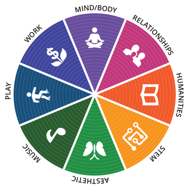

* Speaks fluent English, Korean, and intermediate-level Mandarin (HSK 5). Learning to speak Norwegian (Bokmål) at the moment.
* Speaks with machines mostly in Typescript/Javascript and Python. Used to speak Java and C, but I forgot them.
* Away from work, you will probably find me fixing things around the house, cooking and playing with my dog.
* interests: mental health | renewable energy | architecture | urban transit & farming | cybersecurity

Except for some work related repos, I utilize the learning wheel inspired by Gardener's theory of Multiple Intelligence to organize the repos.

The categories are: 

**Creative**
- Aesthetic
- Music

**Practical**
- Play
- Work

**Well-being**
- Mind & Body
- Relationships

**Academic**
- STEM
- Humanities
